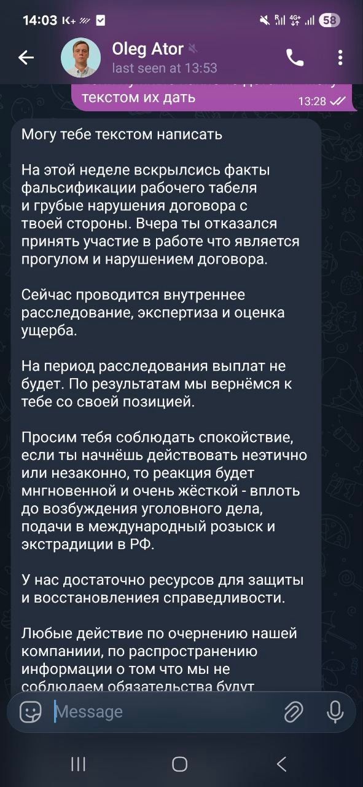

# Why you should not work at Aixpert company, cooperation and investments here carry increased risk

**[Русская версия](./index.html)**

---

In this article, I will share my experience working with the Russian company **LLC "AIXPERT"** and its offshore shell companies as an AI engineer. At the time of publication, the company has not paid compensation for the last period worked, the amount is approximately **$6,650**. Instead of resolving the situation, I receive threats in private messages from the director.

## History of cooperation

Work began in September 2024. Negotiations were conducted by company representative **Oleg Ator**. Agreed terms: $4,000 USD/month + bonuses, remote work. They promised a white service contract with TWS Labs company in Dubai and transfer to an employment contract in Dubai after 3 months. The essence of the contract - assistance with creating an AI legal consultant for the needs of the Russian corporate market, ML expertise.

At first, everything went relatively smoothly - payments came on time, but the Dubai corporate bank account kept not opening. I began to immerse myself in the project, not suspecting that ahead awaited a systematic story of attempted underpayments, black cash, seagull-style management, and a final scam before New Year without any reasons.

## Beginning of problems

After several months, the first alarming pattern began. The employer unilaterally tried to switch to an hourly payment system, recalculating compensation based on "tracked hours" in a spreadsheet. At the same time, at the stage of agreeing on work conditions, no hourly system was discussed - these are completely different rates and conditions.

**Example:** 169 hours instead of standard 176 = payment reduction (their VPN or who knows what tracked it that way), actually it systematically arrives days late and underpayment of 50-350 bucks. Each underpayment attempt was disputed and corrected only after harsh complaints.

## Contract extension

In autumn 2025, after a year of all these difficulties, the old contract expired (that it was void and that shell company had already been liquidated, I learned later and de facto). It would seem that any rational employer would either part with the employee or improve the conditions. Instead, the contract was extended at the employer's initiative on new terms: $5,000/month for the first 3 months, $5,350 after, now a worthless piece of paper in a new Cypriot shell company without assets and account (TWS Labs LTD).

## Finale: non-payment and blocking

Next, another payment did not arrive on time. After my refusal to work on credit until the debt for the previous period was paid off, they told fairy tales again about temporary difficulties and that the money was already on the way, on Friday night (the nearest night) all access was blocked: Teams, VPN, GitLab. Classic timing for "dirty" dismissals.

After the blocking, **threats began in private messages**: with lawsuits, criminal prosecution, extradition. Attempts to call at any time of day or night. Instead of a simple payment of $6,650 for time worked.

Throughout the entire period of work, no complaints about the quality of my work were expressed.

## How finances work at AiXpert

In short: **not at all**. Here's the real picture of how the company "manages" employee payments.

### Formal structure

At the hiring stage, they promised a white service contract with TWS Labs company in Dubai. In reality, TWS Labs is a shell company without a bank account, which exists only on paper and has no legal connection with AiXpert, no assets and not even a bank account, they will shove a legally void contract with it. With the Cypriot "new" company of the same name, the situation is identical.

### Actual payment scheme

Except for the first months, money came chaotically and unpredictably:

- Systematic delays without warning
- Transfers from personal accounts of individuals from completely different countries: Europe, Cyprus, even completely unfriendly jurisdictions
- Each time a new sender, about whom no one warned you, individual person, fragmentation
- Often a different amount than expected

For the recipient, this created a lot of problems: unexpected transfers without documents from strangers from different countries of the world. Try explaining to the bank where this money comes from and why it's from individuals.

### Explanations for delays

Each time a new story:
- "The company has temporary difficulties"
- "You tracked hours incorrectly"
- "Something broke in the system"

Let me remind you: at the interview stage, we were talking about a white service contract in Dubai, with transfer to employment after three months, bonuses based on key indicators, no timesheets and hourly billing were mentioned, no one talked about "banking difficulties" or sanctions risks either.

### Philosophy of "maybe it'll work"

Full payment came only after it became absolutely clear: without debt repayment, work will not continue. Every month - an attempt to underpay "a little", hoping that the employee won't notice or won't create conflict. At the same time, complaints about work quality were never expressed.

Promises about bonuses? All turned out to be empty words.

## Red flags that are costly to ignore

If you are considering work at AiXpert, here's what awaits you:

- **Shell company for registration** (offshore TWS Labs without bank account and assets, worthless paper, will change in less than a year, offshore for a thousand euros for who knows whom and different ones) - no one will take real obligations
- **Maximum evasion** from any legally significant registration in any jurisdiction
- **Black payment scheme** through individuals from different jurisdictions (including unfriendly ones)
- **Systematic payment delays** without warning and explanation
- **Unilateral changes** to payment terms without agreement
- **Systematic underpayment attempts** through timesheet manipulations
- Constant excuses for delays instead of fulfilling basic reciprocal obligations
- Non-fulfillment of promises about bonus payments
- Payments only under pressure - when it becomes obvious that without payment there will be no work
- **Complete isolation of employees:** You simply won't know or see colleagues at all, literally. All processes are structured so that no one knows anyone and doesn't know what's happening nearby. All direct contacts are prohibited. There is simply no collegial discussion or decision-making.
- Chaotic calls at any time with attempts to impose discussion of next strange ideas that change every day. Emotional swings and seagull management in its pure form.
- Silent blocking of access on Friday night without expressing dissatisfaction, outright lies and failure to fulfill basic financial obligations.
- **Threats and pressure** instead of fulfilling obligations

## Absurdity of the situation: "AI lawyer" without AI development

Now about the most amusing part. AiXpert company positions itself as a developer of an AI lawyer for the Russian market. Let's look at reality:

### All AI expertise = one person

- All ML in the company was held by one person - who they thought to scam before New Year with salary just like that
- This sole ML engineer practically didn't work directly with AI models (management priorities were different)
- **Actual tasks:** DevOps, backend, infrastructure - anything but NOT ML
- Creating microservices and architecture instead of AI development
- Imitating high-load systems without real load
- Over-complicating infrastructure without any business justification

After such a parting, the company had no ML competencies left at all. Obviously, further cooperation is impossible.

### Expert opinion interests no one

Being the only AI specialist in the company:

- Expert opinion was systematically ignored
- Decisions on AI product were made by management without the slightest understanding of ML
- Instead of working with models - endless infrastructure tasks
- Constant change of priorities without any logic
- Clear focus on creating the appearance of project development and budget inflation instead of doing real work
- A year and a bit was needed to hire a second ML specialist, with active notifications that current resources and ambitions are incomparable and need to hire another ML specialist to help or reduce ambitions (a beginner, less than a month after he was hired, they decided not to pay me finally for work done)

### Critical questions

- How is an AI product being developed if the only ML specialist doesn't work with AI models?
- Who in the company has expertise to create legal AI?
- On what basis does management without ML competencies make decisions about an AI product?
- What was even being developed these one and a half years? Where are the clients?
- What are the chances of making a legal AI consultant for a company that in one and a half years proved unable to bring its own processes into basic legal compliance and reduce its legal risks?
- Does this even happen with market history and when risking their own money?

The company claims to be developing a complex AI product for the legal market, while:

- Has no resources for AI development
- Has no ML expertise in management
- The only ML specialist was used not in his profile
- The company itself has complete legal chaos
- After parting, no ML competencies remained at all

**This is not just a management problem. This is a fundamental impossibility to create the declared product.**

## What this means for investors and clients

Let's face the truth.

### For investors

**Financial management:**
- The company doesn't want to pay $6,650 debt to an employee, how will it manage your investments?
- Systematic "temporary difficulties" with payments and banks (apparently, all over the world)
- Chaotic transfers through individuals from different countries without accompanying documents

**Absence of business model:**
- One and a half years of development without a single client
- No customer development, no market validation
- Competitive landscape simply not a subject of conversation
- Management doesn't see this as a problem
- Meanwhile "development" and hiring continue

**Impossibility to create the product:**
- Claims for a complex AI product (legal AI)
- Meanwhile the only ML specialist did DevOps and backend (apparently, there was no one else, and there it's easier to inflate the appearance of progress and budget)
- His expert opinion was ignored
- After parting no ML competencies remained at all
- AI decisions are made by people without understanding of AI

**Reputation:**
- Public case of salary non-payment
- Threats to employee instead of dialogue
- Difficulty hiring qualified specialists after such a story
- Toxic reputation in tech community
- Frankly risky billing schemes

### For clients

**Legal and tax risks:**
- Your contractor uses black schemes through individuals
- Tax consequences for your company
- Problems of cross-border transfer of personal data are not resolved
- The company makes an AI lawyer, but itself has complete legal chaos
- Basic legal compliance for international activity is absent
- Serious risks for clients working with legal data

**Technical risks:**
- Will you trust legal processes to AI from a company without real ML development?
- Product being developed for one and a half years without clients and validation
- Unstable team with such personnel policy
- The only ML specialist practically didn't work with AI models

## Organizational chaos

Besides financial problems and absence of real AI development, here's how work is organized inside:

**Isolation of employees:**
- You won't know your colleagues
- All contacts between employees are actually removed
- No one knows what's happening in neighboring projects or, for example, the frontend developer in this one
- Complete informational isolation

**Seagull management:**
- Absence of strategy and long-term planning
- Chaotic calls at any time of day or night
- Constant change of priorities without justification
- Emotional swings
- Imposing discussion of strange ideas that change every day

**Absence of expertise in management:**
- No basic understanding of ML processes
- Technological decisions are made without competencies
- Specialists' opinions are ignored

## Cherry on top

Imagine the situation: New Year is around the corner, you were just scammed on salary without a single reason. And here you read such writings on Friday, see attempts at round-the-clock calls from the director.

And what's the real situation? Payment for work done didn't arrive on time at all. After refusing to work on credit until the previous period is paid - on Friday night everything was quietly blocked. Then pressure and threats began.

Seagull management instantly turned into cheap thug style.

### Screenshot of actual threats from the director

**Threats translation:** "This week facts of timesheet falsification and gross violations of the contract on your part have been revealed. Yesterday you refused to participate in work, which is a violation of the contract. An internal investigation, expertise and damage assessment is currently being conducted. There will be no payments during the investigation period. Based on the results, we will return to you with our position. We ask you to remain calm, if you begin to act unethically or illegally, the reaction will be instantaneous and very harsh - up to initiating criminal proceedings, filing for international wanted list and extradition to the Russian Federation. We have sufficient resources for protection and restoration of justice. Any actions to discredit our company or disseminate information that we do not comply with obligations will be..." (message cuts off)

Moreover, both parties legally live outside the Russian Federation. Everything in this message - crude manipulations and inept pressure of simply an irrational incompetent manager.

**Is this what you were looking for in your profession? Do you want to delegate your legal needs to this and buy such automation yourselves? Doesn't the risk bother you?**

---

## Key Information

**Company:** LLC "AIXPERT"
- **OGRN:** 1247700514940
- **KPP:** 771001001
- **INN:** 9710135746

**Offshore shell:** TWS Labs LTD
- **Registration:** Cyprus, MCIT ΗΕ 467348, CYDRCOR.HE467348

**Representative:** Oleg Ator

**Debt amount:** ~$6,650

**Employment period:** September 2024 - December 2024

---

## Keywords for search

AiXpert, AIXPERT, LLC AIXPERT, Oleg Ator, TWS Labs LTD, salary non-payment, AI engineer, machine learning, ML engineer, employer doesn't pay, employer blacklist, tech company fraud, salary non-payment, AI lawyer, legal AI

**[Русская версия](./index.html)**
